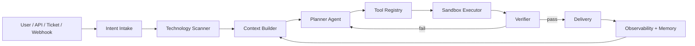

# Architecture

## Core Idea

The LLM is not the whole system. It is one reasoning layer inside a harness that controls:

- Context retrieval
- Tool schemas
- Permissions
- Execution modes
- Verification
- Audit traces
- Delivery artifacts
- Human approval gates

## Universal Adapter Contract

Every technology adapter returns:

- Stack name and confidence
- Detected markers
- Install commands
- Test commands
- Build commands
- Run commands
- Verification notes

That gives the planner a deterministic starting point before any model call.

## Execution Modes

- `PLAN_ONLY`: produce plan, commands, agents, tools, and gates. No mutation.
- `SUPERVISED`: low-risk tools can run after policy checks; high-risk actions wait for approval.
- `AUTONOMOUS_LAB`: intended only for disposable sandboxes; critical actions remain gated.

## Tool Policy

Tools are described by protocol, category, risk, approval requirement, and capabilities. MCP is the preferred boundary because it lets the same tool work across clients and agent runtimes.
